# Customized Arduino-FFB-wheel for Guillemot Force Feedback Racing Wheel
## About this project
### Motivation
It gets more and more difficult to find working Windows 11 drivers for this wheel.

Even the old [Vista drivers](https://support.thrustmaster.com/en/product/ffdrw-en/) which worked fine for me some years ago only work with the iRacing FFB test program (WheelCheck.exe) anymore, but not with any of my games - they simply crash. I already replaced "System32/immpid.dll" with the one from "SysWOW64" and although this fixes the crashes I do not get any Force Feedback effects in games at all (the green effect LED on the Main PCB also does not blink).

There is also another old [driver on archive.org](https://archive.org/details/Guillemot-Thrustmaster-ForceFeedback-wheel-64bit-driver) which is supposed to work according to some forums. But even after disabling the Windows driver signature check the driver was marked as non-functional in the device manager and was not functional.

As a consequence I decided to reverse engineer the hardware and replace the Main PCB of the wheel with an Arduino Pro Micro board. This way it supports Force Feedback via USB HID and does not need any drivers at all.
The nice thing about this wheel is that the Motor Control PCB can be reused and only the Logic Board has to be replaced.

For the firmware I tried multiple projects, e.g.:
- [ranenbg/Arduino-FFB-wheel](https://github.com/ranenbg/Arduino-FFB-wheel)
- [vsulako/AFFBWheel](https://github.com/vsulako/AFFBWheel) (see my [unfinished fork here](https://github.com/tobigun/AFFBWheel))
- [YukMingLaw/ArduinoJoystickWithFFBLibrary](https://github.com/YukMingLaw/ArduinoJoystickWithFFBLibrary)

Arduino-FFB-wheel was the most complete, so this project was used as the foundation.

### Firmware
This repo is a fork of Miloš Ranković's [Arduino-FFB-wheel](https://github.com/ranenbg/Arduino-FFB-wheel), customized for the Guillemot Force Feedback Racing Wheel. As none of the pre-compiled binaries of the original project were suitable for this wheel, this project provides a configuration for the hardware and some minor software adjustments.

**Hardware configuration:**
- Analog X-Axis
- Hat Switch
- PWM motor control in 0-50-100 mode (hardcoded, so no need to configure it via the config software)
- Matrix keypad with 12 buttons
- Usage of 5 analog axis:
  - X-Axis (wheel angle)
  - Throttle
  - Brake
  - 2x analog levers on the wheel
- Force Feedback (of course)

### Original PCBs
The wheel consists of five PCBs:

- Main PCB, i.e. the logic board with the I-Force 2.0 chip: 
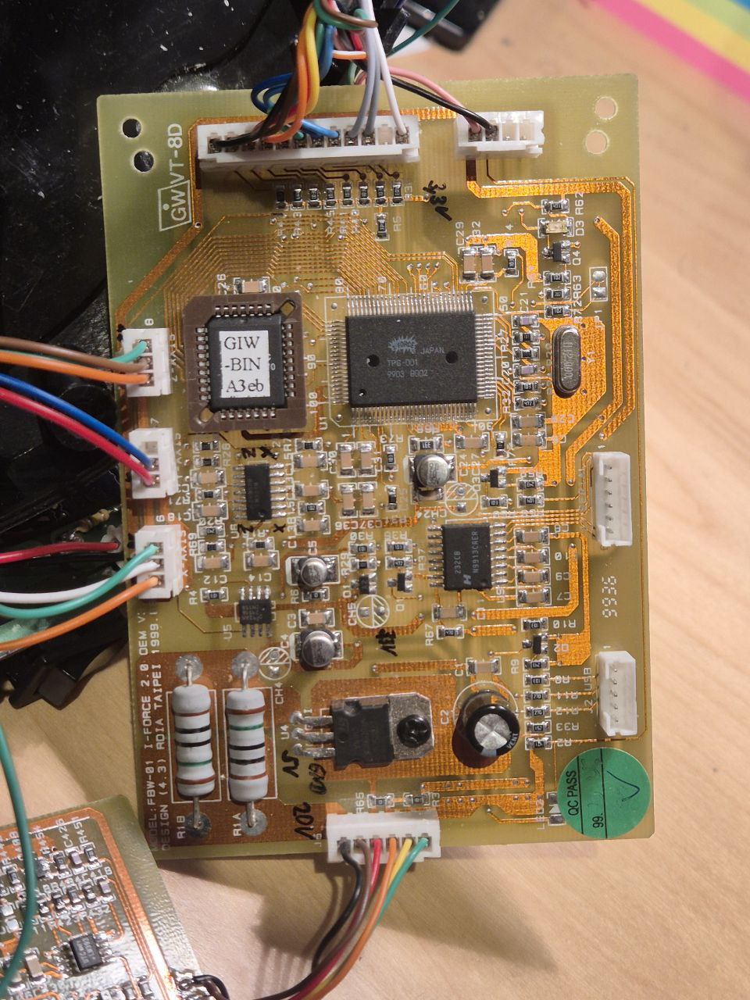

- Motor PCB (contains the PWM H-Bridge): 
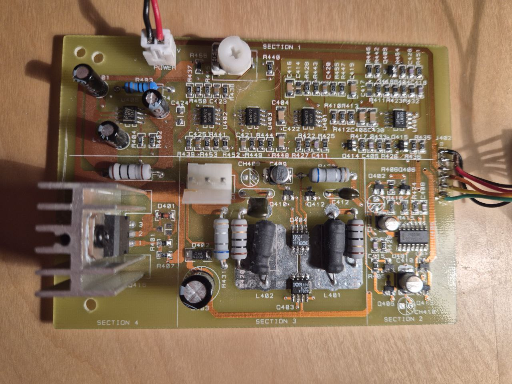

- Front Button PCB: 

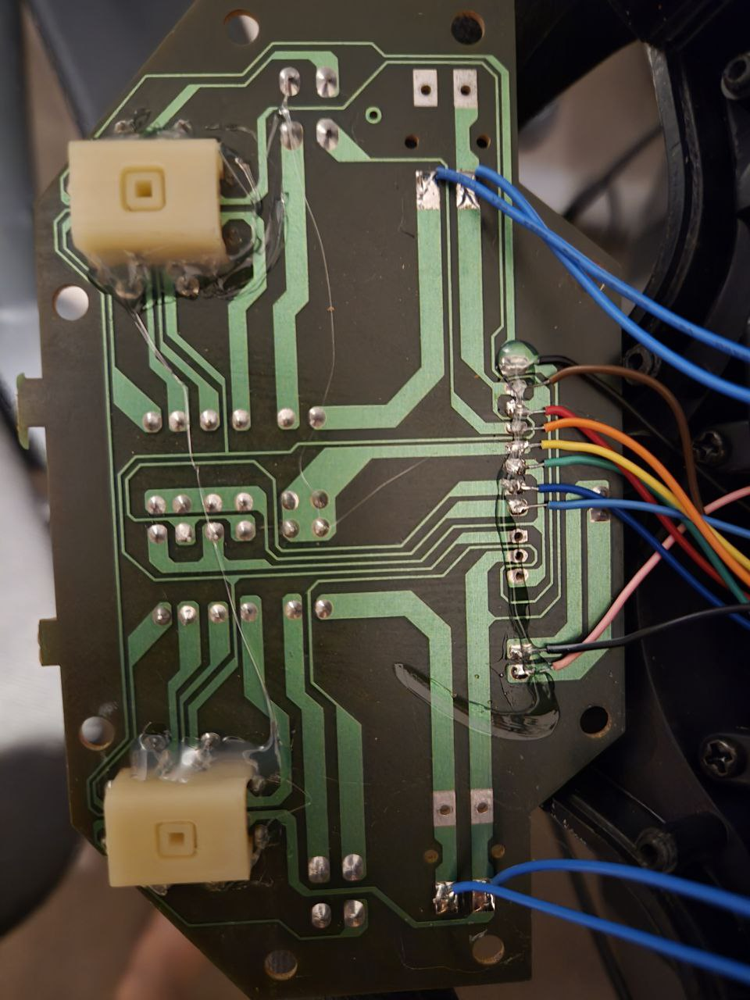
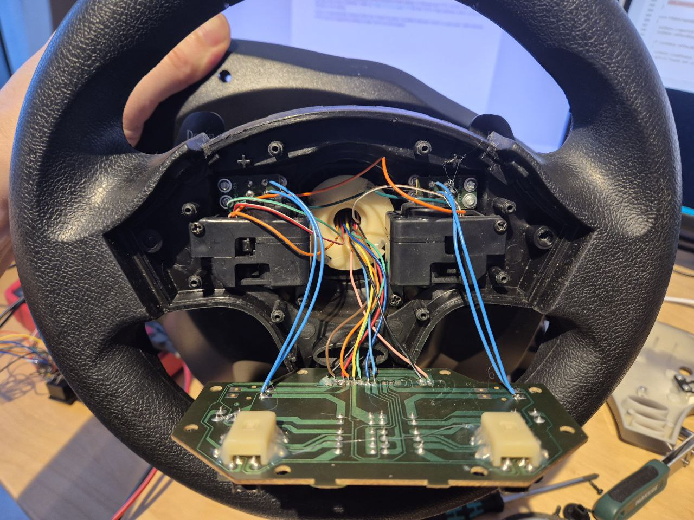

- Gear Shift PCB: 
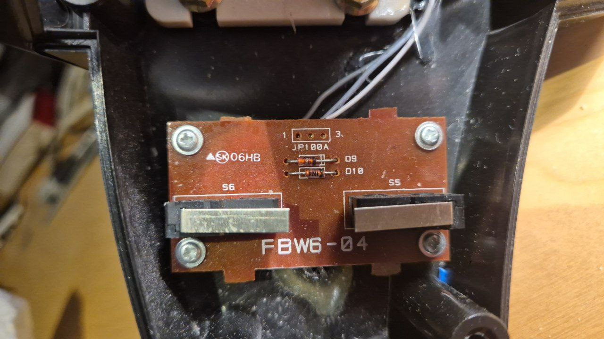

- Power PCB (Note: already modified on the pictures). Contains power connector and switch, pedal connector and a digital switch (74HC4066). The 74HC4066 disables the two analog levers on the wheel when the pedals are connected. 
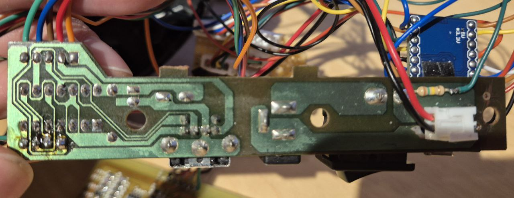
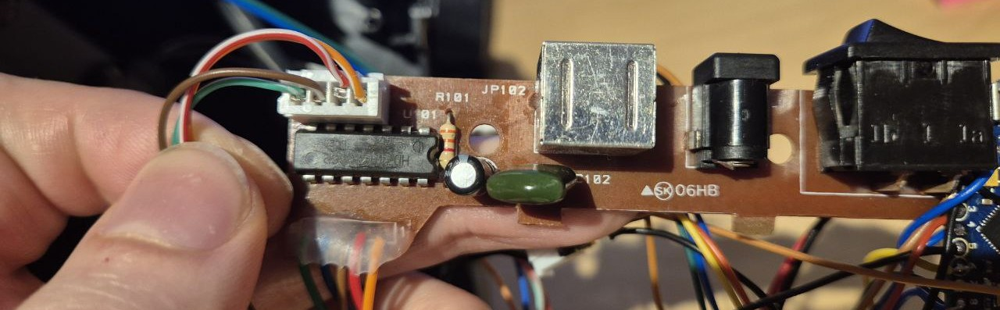

All PCBs connected:
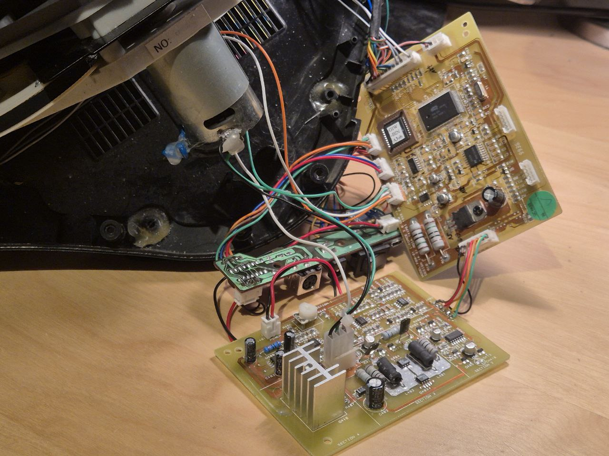

### Arduino Main PCB
All of the original PCBs will be reused. The only PCB that will be replaced is the Main PCB. Instead an Arduino Pro Micro is used. I placed it on the Power PCB:
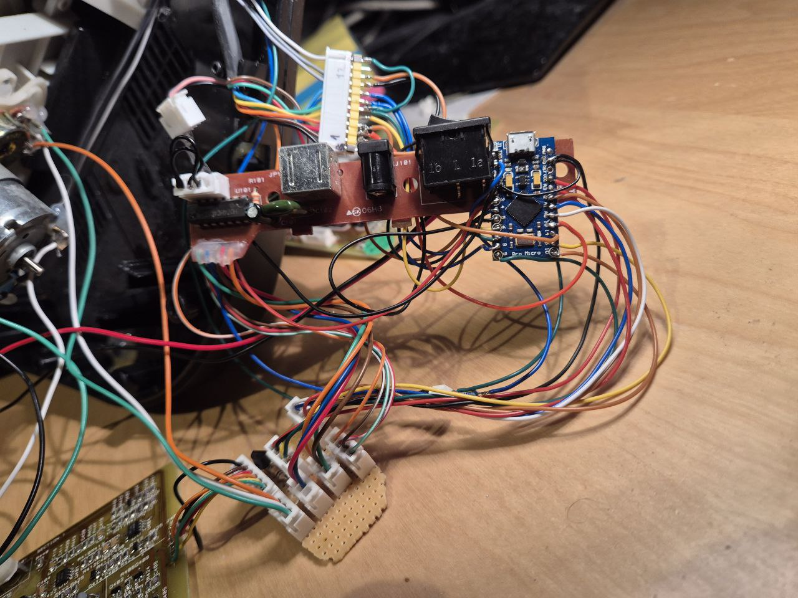

#### Wiring
Here is the overview of the connectors that are located on the Main PCB that now have to be connected to the Arduino board instead:
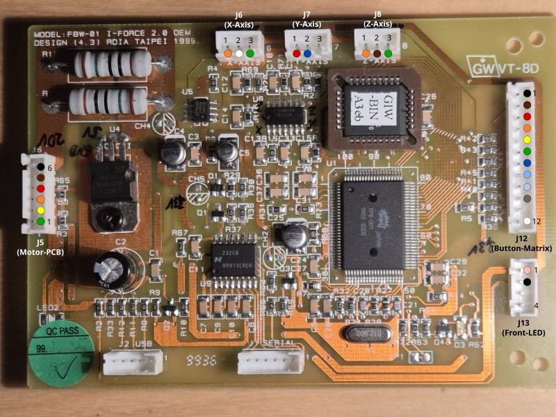

<table>
<tr><th colspan="3">Connector</th><th rowspan="2">Signal</th><th rowspan="2">Pin (Arduino Pro Micro)</th></tr>
<tr><th>Name</th><th>Pin</th><th>Color</th></tr>

<tr><td rowspan="6">J5 (Motor PCB Connector)</td>
    <td>1</td><td style="background:green">green</td><td>Motor PWM</td><td>D9</td></tr>
<tr><td>2</td><td style="background:yellow">yellow</td><td>Motor Enable switch</td><td>D10 (via BJT)</td></tr>
<tr><td>3</td><td style="background:orange">orange</td><td>GND</td><td>GND</td></tr>
<tr><td>4</td><td style="background:red">red</td><td>GND</td><td>GND</td></tr>
<tr><td>5</td><td style="background:brown">brown</td><td>GND</td><td>GND</td></tr>
<tr><td>6</td><td style="background:black;color:white">black</td><td>+20V (from power supply)</td><td>- (unused)</td></tr>

<tr><td rowspan="3">J6 (X-Axis Potentiometer)</td>
    <td>1</td><td style="background:orange">orange</td><td>VCC</td><td>VCC (+5V)</td></tr>
<tr><td>2</td><td style="background:white">white</td><td>Analog X-Axis (0 .. VCC)</td><td>A0</td></tr>
<tr><td>3</td><td style="background:green">green</td><td>GND</td><td>GND</td></tr>

<tr><td rowspan="3">J7 (Y-Axis Potentiometer)</td>
    <td>1</td><td style="background:red">red</td><td>74HC4066 Supply Voltage</td><td>VCC (+5V)</td></tr>
<tr><td>2</td><td style="background:blue;color:white">blue</td><td>Analog Y-Axis (0 .. VCC)</td><td>A1</td></tr>
<tr><td>3</td><td style="background: repeating-linear-gradient(45deg,#eee,#eee 4px,#ccc 4px,#ccc 8px);">n.c.</td><td>-</td><td>-</td></tr>

<tr><td rowspan="3">J8 (Z-Axis Potentiometer)</td>
    <td>1</td><td style="background:orange">orange</td><td>VCC</td><td>VCC (+5V)</td></tr>
<tr><td>2</td><td style="background:brown">brown</td><td>Analog Z-Axis (0 .. VCC)</td><td>A2</td></tr>
<tr><td>3</td><td style="background:green">green</td><td>GND</td><td>GND</td></tr>

<tr><td rowspan="12">J12 (Button Matrix)</td>
    <td>1</td><td style="background:black;color:white">black</td><td>Matrix column 1</td><td>D5</td></tr>
<tr><td>2</td><td style="background:brown">brown</td><td>Matrix column 2</td><td>D14</td></tr>
<tr><td>3</td><td style="background:red">red</td><td>Matrix column 3</td><td>D15</td></tr>
<tr><td>4</td><td style="background:orange">orange</td><td>Matrix column 4</td><td>D2</td></tr>
<tr><td>5</td><td style="background:yellow">yellow</td><td>Matrix row 1</td><td>D6</td></tr>
<tr><td>6</td><td style="background:green">green</td><td>Matrix row 2</td><td>D7</td></tr>
<tr><td>7</td><td style="background:blue;color:white">blue</td><td>Matrix row 3</td><td>D1 (TX0)</td></tr>
<tr><td>8</td><td style="background:#add8e6">light blue</td><td>Matrix row 4</td><td>D4</td></tr>
<tr><td>9</td><td style="background:#d3d3d3">light grey</td><td>Gear Shifter - Up (Matrix column 1)</td><td>D5</td></tr>
<tr><td>10</td><td style="background:grey">grey</td><td>Gear Shifter - Down (Matrix column 2)</td><td>D14</td></tr>
<tr><td>11</td><td style="background: repeating-linear-gradient(45deg,#eee,#eee 4px,#ccc 4px,#ccc 8px);">n.c.</td><td>-</td><td>-</td></tr>
<tr><td>12</td><td style="background:white">white</td><td>Gear Shifter - Matrix row (Matrix row 2)</td><td>D7</td></tr>

<tr><td rowspan="4">J13 (Front LED)</td>
    <td>1</td><td style="background:#ff66cc">rose</td><td>LED Anode (+)</td><td>D3 (via 820 Ohms Resistor)</td></tr>
<tr><td>2</td><td style="background:black;color:white">black</td><td>LED Cathode (-)</td><td>GND</td></tr>
<tr><td>3</td><td style="background: repeating-linear-gradient(45deg,#eee,#eee 4px,#ccc 4px,#ccc 8px);">n.c.</td><td>-</td><td>-</td></tr>
<tr><td>4</td><td style="background: repeating-linear-gradient(45deg,#eee,#eee 4px,#ccc 4px,#ccc 8px);">n.c.</td><td>-</td><td>-</td></tr>

<tr><td rowspan="4">JP101 (Analog Levers) [Optional]</td>
    <td>1</td><td style="background:orange">orange</td><td>VCC</td><td>VCC (+5V)</td></tr>
<tr><td>2</td><td style="background:red">red</td><td>Analog Axis - Lever left</td><td>A3</td></tr>
<tr><td>3</td><td style="background:brown">brown</td><td>Analog Axis - Lever right</td><td>A10</td></tr>
<tr><td>4</td><td style="background:green">green</td><td>GND</td><td>GND</td></tr>

<tr><td rowspan="2">Blue Front LED [Optional]</td>
    <td>-</td><td style="background:blue"></td><td>LED Anode (+)</td><td>D0 (RX1) via 4.7 kOhms resistor</td></tr>
<tr><td>-</td><td style="background:black;color:white"></td><td>LED Cathode (-)</td><td>GND</td></tr>

<tr><td rowspan="2">Green Front LED [Optional]</td>
    <td>-</td><td style="background:green"></td><td>LED Anode (+)</td><td>+20V (via 150 kOhms resistor)</td></tr>
<tr><td>-</td><td style="background:black;color:white"></td><td>LED Cathode (-)</td><td>GND</td></tr>
</table>

Make a little connector hub PCB to hold the motor switch transistor and  to connect all of the GND and VCC pins together. This way you can keep the existing connectors and you will still be able to reconnect them to the original Main PCB. But you can also cut the original connectors and solder the wires directly to the Arduino board.
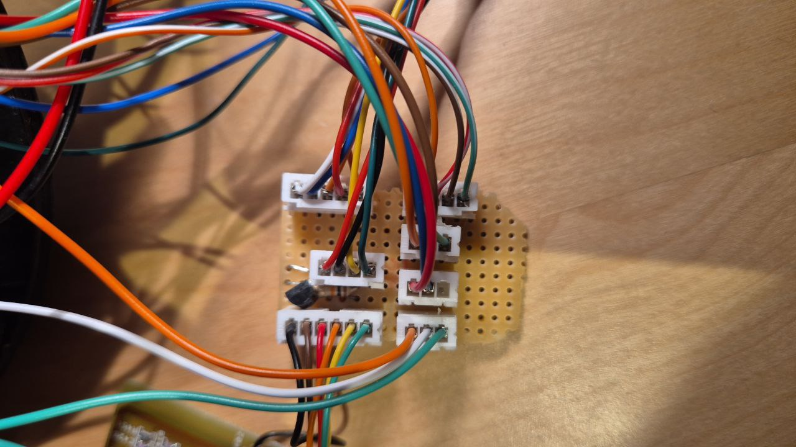

# Arduino-FFB-wheel
A stand-alone DirectInput USB device is recognized in Windows as a joystick with force feedback functionality, based on BRWheel by Fernando Igor in 2017.

Firmware features:
- supported Arduino boards: Leonardo, Micro, and ProMicro (ATmega32U4, 5V, 16MHz)
- 4 analog axis + 1 for an optical or magnetic encoder, 2 FFB axis (with multichannel PWM or DAC output)
- for 2 FFB axis mode - 2 magnetic encoders may be used (for X and Y axis)
- automatic or manual analog axis calibration
- up to 16 buttons by 4x4 matrix or via **[button box firmware](https://github.com/ranenbg/Arduino-FFB-wheel/tree/master/tx_rw_ferrari_458_wheel_emu_16buttons)** uploaded to Arduino Nano/Uno
- up to 24 buttons by 3x8bit shift register chips
- analog XY H-pattern shifter (configurable to 6 or 8 gears + reverse gear, XY axis invert, reverse gear button invert)
- fully supported 16bit FFB effects (custom force effect not implemented)
- envelope and conditional block effects, start delay, duration, deadband, and direction enable
- FFB calculation and axis/button update rate 500Hz (2ms period)
- many firmware options (external 12bit ADC/DAC, automatic/manual pedal calibration, z-index support/offset/reset, hat switch, button matrix, external shift register, hardware wheel re-center, xy analog H shifter, FFB on analog axis)
- RS232 serial interface for configuring many firmware settings (10ms period)
- fully adjustable FFB output in the form of 4-channel digital 16bit PWM or 2-channel analog 12bit DAC signals
- available PWM modes: PWM+-, PWM+dir, PWM0-50-100, RCM (if 2 FFB axis: 2CH PWM+-, 2CH PWM+dir, 2CH PWM0-50-100, 2CH RCM)
- available DAC modes: DAC+-, DAC+dir, DAC0-50-100 (if 2 FFB axis: 1CH DAC+-, 2CH DAC+dir, 2CH DAC0-50-100)
- load cell support for 24bit HX711 chip (for Y axis only)
- all firmware settings are stored in EEPROM (and automatically loaded at each Arduino powerup)
- original wheel control user interface **[Arduino FFB gui](https://github.com/ranenbg/Arduino-FFB-gui)** for an easy configuration and monitoring of all inputs/outputs 

Detailed documentation and more information about the firmware can be found in txt files inside **[docs](https://github.com/tobigun/Arduino-FFB-wheel/tree/master/brWheel_my/docs)** folder.
# Firmware pinouts and wiring diagrams

**Note:** some pin mappings in the image are outdated. Check the wiring table above for the correct ones.

## Button matrix pinouts

**Note:** the digital inputs for the matrix are not correct in the image. Check the wiring table above for the correct ones.

## Firmware upload procedure
You can use **[XLoader](https://github.com/tobigun/Arduino-FFB-wheel/tree/master/XLoader)**:
- set 57600baud, ATmega32U4 microcontroller and select desired HEX
- press the reset button on Arduino (or shortly connect the RST pin to GND)
- select the newly appeared COM port (Arduino in bootloader mode*) and press upload, you will only have a few seconds

*It is possible that some cheap Chinese clones of Arduino Leonardo, Micro, or ProMicro do not have a bootloader programmed. In that case you need to upload the original Arduino Leonardo bootloader first. You can find more details about it here: https://docs.arduino.cc/built-in-examples/arduino-isp/ArduinoISP

## How to compile the source
In order to compile the firmware yourself you may use Windows 11, you need to install Arduino IDE v2.3.6 and Arduino Boards v1.8.7. You must place the libraries (from the `libraries` folder) in your `.../documents/Arduino/Libraries` folder.

## Credits
- Miloš Ranković: [Arduino-FFB-wheel](https://github.com/ranenbg/Arduino-FFB-wheel)
- FFB HID and USB core for Arduino by: Peter Barrett
- BRWheel firmware by: Tero Loimuneva, Saku Kekkonen, Etienne Saint-Paul, and Fernando Igor
https://github.com/fernandoigor/BRWheel/tree/alphatest
